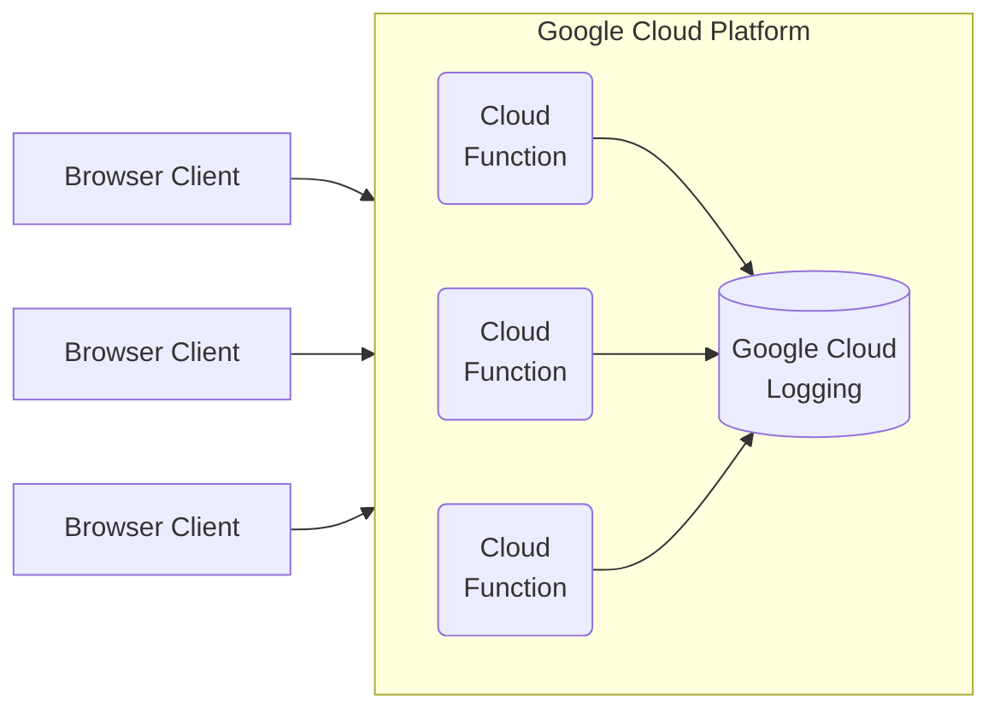

## Overview

In Q3 of 2023, while at [Stylitics](https://stylitics.com), I was tasked with designing a system that would allow my team to monitor run-time errors from our many Third-Party JavaScript applications. Our suite of products are all client-side rendered widgets that require some configuration to render properly. This paradigm limits our implicit visibility into the run time of our applications, across the many websites they are running within.

## System Requirements

In order for this system to function successfully we needed to meet the following requirements
- Allow the organization visibility into run-time errors in our products
- Provide a very slim client side integration with the back-end system
- Limit cost increases with our cloud provider, Google Cloud Platform
- Require minimal maintenance

## System Architecture

### Server Architecture

The server architecture we ended up choosing heavily favors cost savings in cloud computing costs by keeping things very simple. To intake requests, we have a Google Cloud function that can horizontally scale with high traffic loads. This cloud function then constructs a log entry and writes it to Google Cloud Logging for later analysis. This architecture also allows us to integrate Google Cloud Monitoring for these logging events, though at the time of writing, _this has not been implemented_.



### Client SDK

To provide a good developer experience when integrating with the backend across the 10+ applications that my team manages, we added a thin SDK to our core library that exposes an intuitive API for engineers to take advantage of. The consumer simply creates a new instance of our domain object `Logger`, passing some configuration, which then provides a number of methods. 

```typescript
 const logger = new Logger(...config);
 // to send an error to the backend, and log to the browser console
 logger.error()
 // to throw an error and stop execution of the script
 logger.throwError()
```
The other consideration we needed to make is to accommodate the asynchronous nature of our products. All of the products we ship are essentially client-side rendered Single Page Applications that perform a number of data fetching operations before the UI is rendered. This means that...

1. Not all of our `Logger` configuration is available when we create a new instance
2. Errors may need to be logged during the initial data fetching operations

To address this issue, we made all of the configuration optional and expose an `update()` method so that we can add more data to the logged errors as said data becomes available.

## Outcomes
 
Since deploying this system to production in October 2023, we've integrated it with two of our products, with more integrations to come in Q1 2024. One of these products is a part of our core offering, and this error monitoring system has helped us identify run-time errors in two environments that we don't often test. Both of those bugs have now been patched, leading to more customer engagement analytics for that product, and in turn, more potential revenue for our clients.
